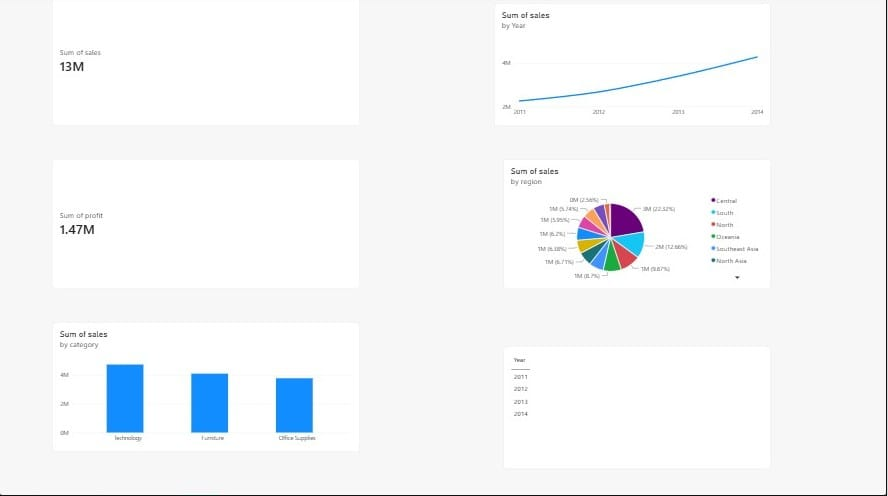

# Sales Dashboard – Power BI Project

## 📊 Overview
An interactive sales analytics dashboard built using Power BI Desktop, analyzing revenue, profit, and regional performance from a retail sales dataset.

## 🛠️ Tools Used
- Power BI Desktop
- Power Query (data cleaning and transformation)

## 📁 Dataset
Sample Superstore Sales Dataset (sourced from Kaggle) — includes order details, sales, profit, category, region, and date fields.

## 📈 Dashboard Features
- KPI cards showing Total Sales and Total Profit
- Bar chart: Sales by Category
- Line chart: Sales trend by Year (2011–2014)
- Pie chart: Sales distribution by Region
- Interactive Year slicer for dynamic filtering

## 🔍 Key Insights
- Total sales across the dataset reached ₹13M with a profit of ₹1.47M
- Sales showed a consistent upward trend from 2011 to 2014
- Technology was the top-performing category by sales
- Central region contributed the highest share of sales at 22.5%

## 📸 Screenshot

